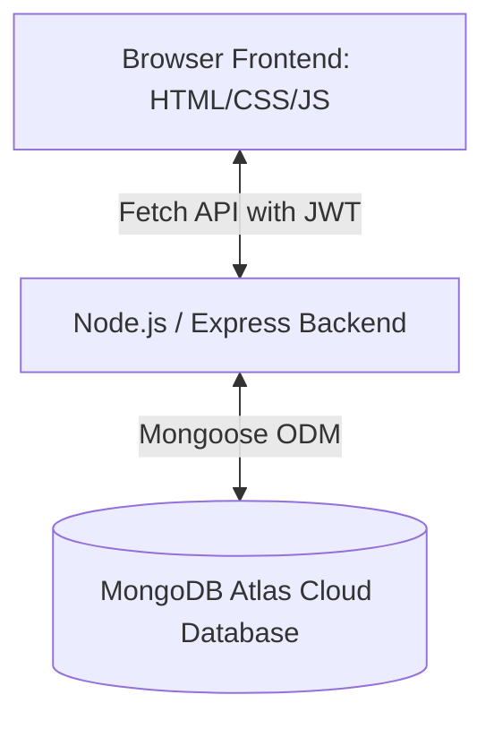

# Project Report: Campus Task Manager

**Course**: Academic Mini Project (Software Engineering)  
**Project Title**: Campus Task Manager  
**Tech Stack**: Node.js, Express, MongoDB Atlas, HTML5, CSS3, Vanilla JavaScript  
**Author**: S Oviya  
**Date**: July 2026  

---

## 1. Abstract
The "Campus Task Manager" is a web-based task management application tailored specifically to the needs of university students. The system consolidates academic assignments, examination dates, project deadlines, and personal task management into a single, cohesive interface. The application features user authentication using JWT, task tracking with customized filters, desktop deadline notifications, a simulated Pomodoro study mode with dynamic ambient noise synthesis, and an interactive calendar visualization. This report details the problem statement, system architecture, database design, testing methodology, and the implementation results.

---

## 2. Introduction & Problem Statement
College students frequently juggle multiple courses, assignments, laboratory submissions, exams, and extracurricular responsibilities. The lack of a central, consolidated dashboard results in missed deadlines, high stress levels, and poor time management.

Existing generic task management tools (e.g., Trello, Todoist) suffer from several drawbacks:
1. **Lack of Academic Framing**: They do not support school-specific metadata like course codes, syllabus categorization (Exams vs Assignments), or study intervals.
2. **Complexity**: Many tools require steep learning curves and lack localized notification mechanisms for fast-paced student schedules.
3. **No Focus Integration**: Task lists are detached from students' study environments.

The **Proposed System** solves these limitations by integrating academic task categorization, browser-native deadline alerts, a Pomodoro timer directly linked to course tasks, and an interactive month-grid calendar into one easy-to-use application.

---

## 3. System Architecture & Design
The system is constructed as a secure Multi-Page Application (MPA) using a traditional Client-Server architecture pattern.

### 3.1 Backend Components
- **Server (`server.js`)**: Configures Express, mounts routes, serves static frontend components, and hooks up error handlers.
- **Mongoose ODM & Config (`db.js`)**: Connects securely to MongoDB Atlas using an environment-protected connection string.
- **Controllers**:
  - `authController.js`: Manages student registration, login password hashing via `bcryptjs`, and session profile retrievals.
  - `taskController.js`: Conducts database queries for creating, reading, updating, deleting, and bulk managing tasks.
- **Middleware**:
  - `auth.js`: Extract bearer tokens from Authorization headers, validates JWT tokens, and attaches user records to incoming requests.
  - `validate.js`: Enforces input formats on authentication payloads before hitting database handlers.

### 3.2 Frontend Component Architecture
- **API Client (`js/api.js`)**: An abstracted HTTP client wrapping the Fetch API. It handles header attachments (such as Bearer tokens) and intercepts `401 Unauthorized` responses to automatically redirect expired sessions to `login.html`.
- **Auth Handler (`js/auth.js`)**: Coordinates user inputs on the login and register forms, carries out validation, handles loading states, and saves tokens locally.
- **Layout Manager (`js/app.js`)**: The application shell controller. It verifies authorization, injects the sidebar and top navigation bars, launches task modals, and handles common dialog operations.
- **Individual Page Controllers**:
  - `dashboard.js`: Populates widgets (Today's Focus, upcoming deadlines, status counts) and handles the inline quick-add form.
  - `tasks.js`: Displays full task cards, supports sorting, status filtering, category filtering, search, and bulk status updates/deletions.
  - `study.js`: Controls the Pomodoro clock intervals and generates audio streams directly on the browser's audio graph.
  - `calendar.js`: Computes calendar grid offsets, renders priority indicators, and coordinates day selection details.

---

## 4. Database Schema Design
The application utilizes two primary collections in MongoDB: `users` and `tasks`.

### 4.1 User Schema
| Field | Type | Rules | Description |
|---|---|---|---|
| `_id` | ObjectId | Auto-generated | Primary Key |
| `name` | String | Required, Trimmed | Student's full name |
| `email` | String | Required, Unique, Lowercase | Valid email address |
| `password` | String | Required, Min. Length 6 | Salted hash of user password |
| `createdAt` | Date | Default `Date.now` | Registration timestamp |

### 4.2 Task Schema
| Field | Type | Rules | Description |
|---|---|---|---|
| `_id` | ObjectId | Auto-generated | Primary Key |
| `title` | String | Required, Max. 100 | Task title / description |
| `description` | String | Optional | Detailed instructions or notes |
| `dueDate` | Date | Required | Submission / Exam date |
| `priority` | String | Enum: High, Medium, Low | Priority level for visual highlights |
| `status` | String | Enum: Pending, Completed | Task completion state |
| `category` | String | Enum: Assignment, Exam, Project, Personal | Syllabus sorting tag |
| `courseCode` | String | Optional | e.g. CS101, MAT202 |
| `reminders` | Object | Enabled (Boolean), Option (Enum) | Desktop alert configuration |
| `userId` | ObjectId | Ref `User` | Foreign Key linking to the task owner |
| `createdAt` | Date | Timestamps auto-generated | Creation timestamp |
| `updatedAt` | Date | Timestamps auto-generated | Last modification timestamp |

---

## 5. Software Development Modules & Results
1. **Module 1 — Database & Seeding**: Configured Atlas connection strings, compiled schemas, and ran validation scripts to test database integrity.
2. **Module 2 & 3 — API Development**: Completed task routes (supporting searches, status updates, and bulk deletions) and authorization endpoints.
3. **Module 4 — Design System & Authentication Pages**: Crafted a CSS system based on HSL color tokens, responsive page layout grids, custom input feedback elements, and custom toast notification elements.
4. **Module 5 — Dashboard & Task Management**: Tied dashboard counts and task tables to real database values, handled multi-faceted dropdown filtering, keyword search queries, and built the task detail side drawers.
5. **Module 6 — Advanced Focus & Calendar Systems**: Written periodic reminder loops, browser desktop alerts, a synthesized Soundscape, Pomodoro timer triggers, and a full-featured monthly grid view.

---

## 6. Verification & Test Summary
The backend APIs and frontend scripts were verified using built-in automated test suites.

- **Authentication Tests (`testAuth.js`)**: Validated registration validation limits, email uniqueness checks, incorrect credentials, profile retrieval protection, and logouts. **Result: 9/9 Passed (100%)**.
- **Task API Tests (`testTasks.js`)**: Checked CRUD routines, priority filters, keyword searches, bulk status changes, and bulk deletions. **Result: 8/8 Passed (100%)**.
- **Static Assets Audit (`validateFrontend.js`)**: Audited CSS custom variables, DOM elements (like forms and ids), error text labels, keyframe properties, and redirect rules. **Result: 100% Validated**.

---

## 7. Conclusions & Future Scope
The Campus Task Manager is successfully fully implemented and operates as a responsive, reliable mini project. It conforms precisely to the database structure and the system architecture.

### Future Scope:
1. **Real External Calendar Integration**: Connect the client directly to the Google Calendar API or Outlook calendar API instead of simulating the sync flow.
2. **Collaborative Study Rooms**: Introduce WebRTC socket rooms so students can share Pomodoro intervals.
3. **Analytics Banners**: Chart progress week-over-week using clean visual graphics to help students track study velocity.

---

## 8. References
- *Mongoose Documentation (Schemas and Queries)*: https://mongoosejs.com/
- *MDN Web Docs (Web Audio API & Notifications)*: https://developer.mozilla.org/
- *Express.js Guide (Routing & Middleware)*: https://expressjs.com/
